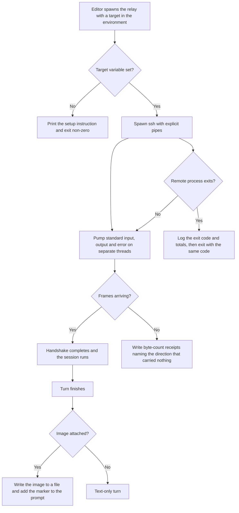

# OpenCrabs Windows Desktop Control and ACP Bridge Lite PRD

## 1. Overview

### Layer 1: Human PRD

| Field | Content |
|-------|---------|
| Problem | OpenCrabs grew up on Linux and macOS, so its desktop-control paths assumed a POSIX host: mutual exclusion used advisory locks, scheduled jobs named a POSIX shell, self-update renamed a running executable, and clipboard access assumed a display server. On Windows those paths either fail outright or fail silently, and the CI lane that was supposed to catch that only ever compiled the crate without running it, so Windows-only code could merge uncompiled. Separately, an editor on Windows had no way to reach an agent that runs on an always-on host, because the editor spawns a local process and a command-shell chain swallowed the stdio frames. |
| Outcome | A Windows operator can run OpenCrabs natively, get a real binary out of CI instead of a build that is thrown away, and drive an agent that lives on a remote always-on host from a Windows editor with the same protocol the local path uses. A failed handshake leaves a log that names where the frames died instead of a timeout with no explanation. |
| Users | The fork maintainer, contributors running Windows, and operators who keep one agent on a server and want a desktop window on it. |
| Scope and exclusions | In scope: the Windows lock path, the Windows scheduled-job interpreter, the self-update swap, clipboard behaviour, a Windows CI lane that compiles and executes the binary, a stdio relay executable that carries Agent Client Protocol frames over SSH, image support in the protocol layer, and a deterministic frame dump for review. Excluded: the upstream agent implementation beyond the fork's patches, any new agent capability, packaging installers, code signing, and upstream pull requests that are not separately approved. |
| Decisions and assumptions | Resolved: the relay takes its SSH target and remote binary path from environment variables rather than a compiled-in host, so one artifact serves every operator. Resolved: the CI lane lives in its own workflow file so it cannot collide with the other Windows pull requests. Resolved: diagnostics go to a byte-count log because a silent stdio death cannot be debugged from the client side. Assumption: a Windows runner on a public repository is available without cost, which was measured rather than assumed. |
| Research basis | The fork's own commit history on the Windows series, the upstream issues filed for each control path, and the protocol surface recorded in the companion MonoCode provider PRD. UNVERIFIED: that upstream accepts the parked Windows service approach, since the maintainer parked that lane pending a decision on scheduled task versus service wrapper. |

### Layer 2: Machine Spec

| Field | Content |
|-------|---------|
| Tool Type | CLI plus a small stdio relay executable, with a CI workflow that produces both. |
| Trigger | Manual workflow dispatch or a push to the artifact branch for the build; a process start for the lock; a schedule for jobs; an editor spawn for the relay. |
| Inputs | The crate source, the pinned toolchain file, environment variables naming the SSH target and the remote binary path, and Agent Client Protocol frames on standard input. |
| Outputs | A Windows executable and a relay executable as workflow artifacts, a byte-count log, a frame dump image, and protocol responses on standard output. |

## 2. Requirements

### Review Focus

Should the fork keep carrying the Windows service implementation as a parked branch, or drop it until a Windows host exists to validate scheduled task versus service wrapper? This changes FR-002's scope, not its acceptance criteria.

| ID | Requirement | Priority | Acceptance Criteria IDs |
|---|---|---|---|
| FR-001 | Two OpenCrabs processes on the same Windows profile cannot both own the session store: the second exits with a message that names the held lock instead of corrupting state. | Must | AC-001, AC-002 |
| FR-002 | A scheduled job runs through a command interpreter that exists on Windows, so a job never fails only because it named a POSIX shell. | Must | AC-003 |
| FR-003 | The self-update path replaces the running executable on Windows and leaves a working install, or refuses with an actionable message and leaves the old binary runnable. | Must | AC-004, AC-005 |
| FR-004 | Clipboard read and write work on Windows and return a typed error instead of panicking when no clipboard is reachable. | Should | AC-006 |
| FR-005 | A Windows CI job compiles the crate, executes the produced binary, prints its version, and cannot report success while its build and smoke steps are skipped. | Must | AC-007, AC-008 |
| FR-006 | The relay executable carries Agent Client Protocol frames between a Windows editor and an SSH-hosted agent, taking the SSH target and remote binary path from environment variables. | Must | AC-009, AC-010 |
| FR-007 | The relay writes per-direction byte-count receipts so a failed handshake can be located without guessing which side stopped carrying frames. | Should | AC-011 |
| FR-008 | The protocol layer advertises image support and materializes an inbound image to a local file plus a marker that the agent can read. | Should | AC-012, AC-013 |
| FR-009 | A deterministic frame dump test renders the interface on Windows and can emit an image for review. | Should | AC-014 |
| NFR-001 | The shipped relay binary contains no host name, user name, or credential; the target is supplied at run time. | Must | AC-015 |
| NFR-002 | Every client call class has an explicit budget, and a call past its budget fails naming the call and kills the child process instead of leaving it running. | Must | AC-016, AC-017 |
| NFR-003 | A published release artifact is verified by re-downloading it and checking it against the published digest. | Must | AC-018 |

### Acceptance Criteria

| ID | Requirement IDs | Type | Observable criterion | Required evidence |
|---|---|---|---|---|
| AC-001 | FR-001 | Positive | A second instance started against a profile already held exits with a message naming the held lock, while the first instance keeps running. | Two-process run log showing the refusal and the surviving process |
| AC-002 | FR-001 | Negative | A crashed holder does not leave the profile permanently locked: the next start succeeds. | Kill-and-restart run log with the successful second start |
| AC-003 | FR-002 | Positive | A scheduled job executes on Windows and returns its own output. | Job run receipt carrying the job output |
| AC-004 | FR-003 | Positive | The update path swaps the binary and the new build reports its version afterwards. | Version output before and after the swap, plus the swap log |
| AC-005 | FR-003 | Boundary | A swap that cannot complete is refused with an actionable message and the previous binary still runs. | Refusal log plus a successful run of the previous binary |
| AC-006 | FR-004 | Negative | With no clipboard reachable, the call returns a typed error and the process stays alive. | Test output showing the typed error and a zero exit |
| AC-007 | FR-005 | Positive | The Windows job compiles and its smoke step prints the binary version with exit zero. | Job log line carrying exit status and version |
| AC-008 | FR-005 | Negative | The job cannot conclude success when its build and smoke steps are skipped. | Workflow definition review plus a run whose skipped steps fail the job |
| AC-009 | FR-006 | Positive | An editor handshake completes through the relay and the client receives the initialize response. | Relay log with byte counts plus the server response |
| AC-010 | FR-006 | Boundary | With the target variable unset, the relay exits with a setup instruction instead of hanging. | Run output carrying the setup message and a non-zero exit |
| AC-011 | FR-007 | Positive | A failed handshake leaves a log naming the direction that carried zero bytes. | Relay log excerpt with per-direction totals |
| AC-012 | FR-008 | Positive | The initialize response advertises image support. | Captured initialize response |
| AC-013 | FR-008 | Positive | An inbound image is written to a local file and the prompt carries the marker pointing at it. | Written file listing plus prompt text carrying the marker |
| AC-014 | FR-009 | Positive | The frame dump renders and writes an image file on Windows. | Test output plus the produced image file |
| AC-015 | NFR-001 | Negative | A string scan of the shipped relay binary finds no host name, user name, or key material. | Scan output reporting zero hits |
| AC-016 | NFR-002 | Boundary | Each call class is issued with its declared budget, and a call past it fails naming that call. | Timeout constant review plus an induced-timeout run |
| AC-017 | NFR-002 | Negative | An aborted probe leaves no running child process behind. | Process listing taken immediately after an induced overrun |
| AC-018 | NFR-003 | Positive | Re-downloading a published artifact and checking it against the published digest succeeds. | Digest check output |

### Constraints

| Constraint | Value |
|------------|-------|
| Build host budget | The Windows lane is a public-repository runner; measured usage on this plan is billed at zero, so the constraint is wall-clock, not spend. A cold Windows run needs roughly 48 minutes and the job declares a 90-minute ceiling. |
| Remote host protection | The always-on host has 4 GB of memory and must not run a Rust compile or test; compilation belongs to the runner or to a separate build host. |
| Secret handling | No credential, host name, or user name may be compiled into the relay; the target arrives through environment variables and keys stay in the local key store. |
| State safety | The profile lock must fail closed: a second owner is refused rather than allowed to write the same store. |
| Diagnostics | Every relay start writes a receipt line; a handshake that dies silently is a defect, not an accepted outcome. |

## 3. Architecture & Data Flow

### Components

| Component | Responsibility | Input | Output |
|-----------|----------------|-------|--------|
| Profile lock module | Take an exclusive, kernel-held lock on the profile before the store is opened, and refuse a second owner. | Profile directory path | Lock handle or a refusal naming the holder |
| Scheduled-job interpreter | Resolve a job command through an interpreter that exists on the host platform. | Job definition | Job output or a resolved failure |
| Self-update swap | Replace the running executable and leave a runnable install, or refuse with an actionable message. | Downloaded build | Swapped binary plus a version receipt |
| Clipboard access | Read and write the system clipboard, returning a typed error when none is reachable. | Clipboard request | Clipboard content or a typed error |
| Windows build workflow | Compile the crate on a Windows runner, execute the binary, print its version, and upload the artifact. | Repository source and the pinned toolchain | Artifact plus a smoke receipt |
| Relay executable | Carry protocol frames between the editor and the remote agent, with per-direction byte receipts. | Environment target plus frames on standard input | Remote responses plus a receipt log |
| Protocol image path | Advertise image support and turn an inbound image into a local file plus a marker. | Inbound image payload | Written file and an augmented prompt |
| Frame dump test | Render the interface into a deterministic frame dump and optionally an image. | Render entry point | Frame dump plus an image file |

### Builder Capability Routing Contract

Act on the current request: a PRD alone does not authorize building. At startup, read this PRD and target instructions once; inspect the host-provided available skill/tool catalog, read matching instructions, and check prerequisites. Record chosen routes, UNAVAILABLE preferences, affected IDs, and evidence limits in PROGRESS.md and the audit. Names do not authorize installation or host/model changes; use declared repository-native fallbacks.

| Trigger | Required capability | Preferred skill/tool if available | Fallback if unavailable | Required evidence | Authority |
|---|---|---|---|---|---|
| Change Windows-only control code | Rust editing plus a Windows compile lane | Local edit plus a dispatch of the fork's Windows artifact workflow | Compile-check on a Linux host for type errors and mark Windows-only behaviour UNVERIFIED | Job log line carrying exit status and version | Local edit and fork dispatch allowed; upstream writes need owner approval |
| Probe the agent over its protocol | Shell access plus the agent binary | The agent binary driven directly with protocol frames on standard input | Mark the probe UNVERIFIED when no binary is reachable | Protocol transcript file | Local read-only probe allowed |
| Review a pull request | Repository review workflow | The repository's pull-request review workflow | Manual diff review plus the platform check conclusions | Review comment plus check conclusions | Commenting on our own repository allowed; upstream comments need owner approval |
| Verify a published artifact | Download plus digest check | The release download and the published digest file | Compare the asset list against the release and mark the digest UNVERIFIED | Digest check output | Read-only network access allowed |

### Data Contracts

| Data Item | Schema/Format | Validation |
|-----------|---------------|------------|
| Relay environment | Two variables: the SSH target and the remote binary path | Both non-empty; a missing target prints the setup instruction and exits non-zero |
| Relay receipt log | One line per event carrying a direction label and a byte count | Every start, first byte per direction, and the final exit line are present |
| Protocol frame | JSON object on a single line with a request identifier | Parsed before forwarding; an unparseable line is reported rather than dropped |
| Inbound image | Object carrying base64 data and a media type, or a nested source object | Base64 decoded to a file; a decode failure reports the error and keeps the session alive |
| Build artifact | Windows executable plus the relay executable | Presence enforced by the upload step and the digest verified after publish |

## 4. Implementation & Milestones

| # | Milestone | Implementation Tasks | Done When | Status |
|---|-----------|----------------------|-----------|--------|
| 1 | Windows desktop control parity | Lock, scheduled-job interpreter, self-update swap, clipboard behaviour, and their tests | The Windows lane compiles and executes the binary, and each of the four control paths carries either a passing Windows receipt or an explicit UNVERIFIED note naming the missing host | ✅ Verified |
| 2 | Shippable Windows build and relay | The artifact workflow, the relay executable with byte receipts, protocol image support, and the frame dump test | A dispatch run uploads both executables, and a relay handshake log shows the initialize response with non-zero byte counts in both directions | 🔄 In Progress |
| 3 | Integrated audit and repair | Per-requirement status sweep over every functional and non-functional requirement and acceptance criterion | The audit lists each identifier with a VERIFIED or explicitly UNVERIFIED status plus the check that produced it, and any in-scope defect found is repaired and re-checked | ⬜ Not Started |

### Authority Policy v1

For a new native build, the user's explicit build request authorizes scoped local implementation.

One exact plan approval covers declared local runner transitions.

Pause only for a blocking decision, material scope change, or a genuine new authority boundary: external writes, destructive actions, purchases, credential changes, deployment, production, or owner acceptance.

### Runtime Checks

| Check | Environment/Method | Expected Result | Timeout/Cleanup | Source-State Evidence |
|-------|--------------------|-----------------|-----------------|-----------------------|
| Format and lint | Repository root, the pinned toolchain, the format and lint commands | Zero formatting diff and no lint denials in the changed files | Bounded by the local command; no cleanup needed | Command output recorded against the commit identifier |
| Crate tests | Repository root, the test command for the touched modules | The targeted tests pass and no unrelated test regresses | Bounded by the local command; no cleanup needed | Test summary with the pass count |
| Windows build | Runner, the artifact workflow dispatch on the working branch | The compile and smoke steps both run and the smoke line carries exit zero and a version string | Ninety-minute job ceiling; the runner is discarded afterwards | Job log line plus the uploaded artifact listing |
| Relay handshake | The operator workstation, the relay executable with the target variable set | The client receives the initialize response and the receipt log shows non-zero counts both ways | Under a minute; the relay exits when the remote process exits | Receipt log plus the captured response |
| Artifact digest | Any host, download the published assets and check them against the published digest | Every asset matches its recorded digest | Bounded by the download; no cleanup needed | Digest check output |

## 5. Risks

| Risk | Probability | Impact | Mitigation | Owner |
|------|-------------|--------|------------|-------|
| A Windows-only path merges without ever being compiled | Med | High | The build lane compiles and executes the binary, and the job is written so skipped build steps cannot produce a green conclusion | Fork maintainer |
| The Windows lane is parked upstream, so the fork carries the only working lane | High | Med | Keep the lane in its own workflow file inside the fork and treat the fork as the source of truth until upstream reopens | Fork maintainer |
| The relay hides a stdio death behind a generic timeout | Med | High | Per-direction byte receipts on every start, and a self-test mode that round-trips a marker through the same pump | Fork maintainer |
| A remote host is asked to compile or test and runs out of memory | Med | High | Compilation belongs to the runner; the remote host is used only to execute the built binary | Operator |
| A released artifact is replaced without regenerating its digest | Med | Med | The republish rule: upload, regenerate the digest from the real files, upload the digest, then re-download and check | Fork maintainer |
| An operator points the relay at the wrong host | Low | Med | The target is an explicit environment variable, and a missing value stops the run with a setup instruction rather than a silent default | Operator |

### Failure Modes

| Failure Mode | Detection | Recovery |
|--------------|-----------|----------|
| Relay spawns the remote process but no frames cross | Receipt log shows a first byte in one direction and zero in the other | Read the direction that stayed at zero, correct the layer it names, and re-run the self-test before retrying the editor |
| Second instance corrupts the profile store | The lock refuses the second owner and names the holder | Stop the second instance; if the holder is dead, the kernel releases the lock and the next start succeeds |
| Scheduled job fails because it named a missing shell | Job output reports the interpreter as not found | Route the job through the platform interpreter and re-run |
| Self-update leaves a broken install | The version receipt after the swap does not match the downloaded build | Restore the previous binary from the retained copy and report the refusal instead of retrying the swap blindly |
| Artifact digest mismatch after a publish | The digest check fails on a re-download | Re-upload the correct asset, regenerate the digest from the real files, and re-verify before announcing the release |
| Image payload fails to decode | The prompt reports a decode error and the session stays usable | Send the image again or continue with text; the failure is reported rather than swallowed |

## 6. Progress

Milestone outcomes and Done When are defined in section 4 and are not repeated here. Live state, evidence and the resume delta are kept in PROGRESS.md alongside this file. Status vocabulary: Not Started, In Progress, Verified, Approved, where Approved requires an owner verdict.

Known evidence limits at the time of writing: milestone 1 is Verified through the upstream merge plus the fork's own lane, with the clipboard path carrying a runner receipt rather than a human run on a Windows desktop. Milestone 2 is In Progress: the relay handshake was proven end to end from a Windows editor on 2026-10-02 and the receipt log carries byte counts in both directions, while the artifact swap for the current relay revision and the frame dump image on a fresh runner are still open. Milestone 3 has not started, so every identifier below carries a status only after that sweep.

### Traceability Matrix

| Capability | FR/NFR IDs | AC IDs | Input | Output | Runtime Component | Milestone | Required Evidence |
|---|---|---|---|---|---|---|---|
| Profile exclusion on Windows | FR-001 | AC-001, AC-002 | Profile directory | Lock handle or a refusal | Profile lock module | 1 | Two-process run log |
| Scheduled jobs on Windows | FR-002 | AC-003 | Job definition | Job output | Scheduled-job interpreter | 1 | Job run receipt |
| Self-update swap | FR-003 | AC-004, AC-005 | Downloaded build | Swapped binary | Self-update swap | 1 | Version output and swap log |
| Clipboard behaviour | FR-004 | AC-006 | Clipboard request | Clipboard content or a typed error | Clipboard access | 1 | Test output |
| Windows build lane | FR-005 | AC-007, AC-008 | Repository source | Artifact and smoke receipt | Windows build workflow | 1 | Job log line |
| Remote agent relay | FR-006 | AC-009, AC-010 | Environment target and protocol frames | Remote responses | Relay executable | 2 | Relay log and captured response |
| Relay diagnostics | FR-007 | AC-011 | Relay run | Receipt log | Relay executable | 2 | Log excerpt with totals |
| Image support in the protocol layer | FR-008 | AC-012, AC-013 | Inbound image payload | Written file and augmented prompt | Protocol image path | 2 | Captured response and file listing |
| Deterministic frame dump | FR-009 | AC-014 | Render entry point | Frame dump and image | Frame dump test | 2 | Test output and image file |
| Relay carries no baked target | NFR-001 | AC-015 | Shipped relay binary | Scan result | Relay executable | 2 | Scan output with zero hits |
| Explicit call budgets | NFR-002 | AC-016, AC-017 | Client call | Result or a named timeout | Relay executable | 2 | Timeout review and induced-timeout run |
| Verified release artifacts | NFR-003 | AC-018 | Published assets | Digest result | Windows build workflow | 3 | Digest check output |

